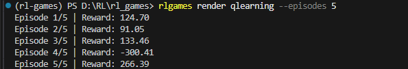
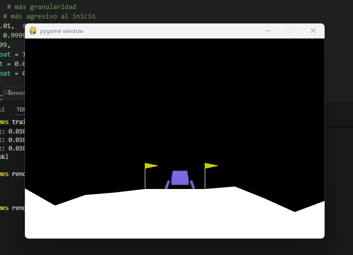

A hands-on repo for understanding how Reinforcement Learning works.
Train, inspect, and visualise RL agents on [LunarLander-v3](https://gymnasium.farama.org/environments/box2d/lunar_lander/) (or any other Gymnasium environment).

## LunarLander-v3 environment

The default environment is [LunarLander-v3](https://gymnasium.farama.org/environments/box2d/lunar_lander/).
The lander starts at the top of the screen and the goal is to land it softly on the landing pad (between the two flags) using thrust and rotation.

### State (observation) — 8 continuous values

| Index | Variable | Description | Range |
|:---:|---|---|---|
| 0 | x | Horizontal position | -2.5 to 2.5 |
| 1 | y | Vertical position | -2.5 to 2.5 |
| 2 | vx | Horizontal velocity | -10 to 10 |
| 3 | vy | Vertical velocity | -10 to 10 |
| 4 | angle | Angle of the lander (radians) | -6.28 to 6.28 |
| 5 | angular velocity | Rotation speed | -10 to 10 |
| 6 | left leg contact | 1 if left leg touches ground, 0 otherwise | 0 or 1 |
| 7 | right leg contact | 1 if right leg touches ground, 0 otherwise | 0 or 1 |

### Actions — 4 discrete

| Value | Action |
|:---:|---|
| 0 | Do nothing |
| 1 | Fire left orientation engine (rotate right) |
| 2 | Fire main engine (thrust up) |
| 3 | Fire right orientation engine (rotate left) |

### Rewards

| Event | Reward |
|---|---|
| Moving towards the landing pad | positive, proportional to distance reduction |
| Moving away from the landing pad | negative |
| Crash | **-100** |
| Successful landing (come to rest) | **+100** |
| Each leg ground contact | **+10** |
| Firing main engine (per frame) | **-0.3** |
| Firing side engine (per frame) | **-0.03** |

An episode is considered **solved** at **+200** points average over 100 episodes.
The episode ends when the lander crashes, lands, or after **1000 time steps** (truncation).

> Run `rlgames inspect` to see live state/action/reward values from the environment.

## Quick concepts — Q-Learning methods

### The core idea

An RL agent interacts with an **environment** in discrete time steps.
At each step it observes a **state** $s$, picks an **action** $a$, receives a **reward** $r$, and transitions to a new state $s'$.
The goal is to learn a **policy** $\pi(s) \to a$ that maximises the total (discounted) reward over time.

### Q-values and the Bellman equation

A **Q-value** $Q(s, a)$ estimates the expected cumulative reward of taking action $a$ in state $s$ and then following the optimal policy.
The optimal Q-values satisfy the **Bellman optimality equation**:

$$
Q^*(s, a) = r + \gamma \max_{a'} Q^*(s', a')
$$

where $\gamma \in [0, 1]$ is the **discount factor** (how much the agent cares about future vs. immediate rewards).

### Tabular Q-Learning

When the state and action spaces are small (or can be discretized), we store Q-values in a table and update them after every transition:

$$
Q(s, a) \leftarrow Q(s, a) + \alpha \bigl[ r + \gamma \max_{a'} Q(s', a') - Q(s, a) \bigr]
$$

- $\alpha$ (learning rate) — how fast we update.
- **$\varepsilon$-greedy** exploration — with probability $\varepsilon$ pick a random action, otherwise pick $\arg\max_a Q(s, a)$. $\varepsilon$ decays over time so the agent gradually shifts from exploring to exploiting.

## Un caso práctico: LunarLander con Tabular Q-Learning

A continuación se detalla cómo se configuró y ejecutó el agente `qlearning` para resolver el entorno de LunarLander-v3. Esta sección es clave para entender la transparencia que buscamos en este repositorio.

### Visualizando el ciclo de aprendizaje

El siguiente diagrama (hecho a mano) ilustra el flujo conceptual de cómo el agente `qlearning` interactúa con el entorno, observando el estado, tomando una acción basada en la **Tabla Q**, recibiendo la recompensa, y ejecutando la **Actualización** de la tabla.

<p align="center">
  
</p>

### Configuración e Hiperparámetros (Config_Diary.py)

Para lograr que el agente aprenda eficientemente en un entorno continuo como LunarLander (el cual discretizamos), se ajustaron cuidadosamente los hiperparámetros. No son valores aleatorios, sino decisiones basadas en la experimentación:

A continuación, mostramos los valores utilizados en el constructor del `QLearningAgent` (visible en `src/rl_games/agents/qlearning.py`):


### Configuración y Estrategia de Entrenamiento (Q-Learning)
Para que el agente logre aterrizar con éxito en un entorno de control continuo como LunarLander-v3, se definieron los siguientes hiperparámetros. Cada uno responde a una necesidad específica del aprendizaje:

n_bins = 14 (Alta Granularidad): Dado que el entorno nos entrega 8 dimensiones continuas (posiciones, ángulos, velocidades), necesitamos "partir" el espacio en trozos pequeños. Con 14 bins, aseguramos que el agente perciba cambios sutiles en la inclinación y velocidad, vitales para no estrellarse.

lr = 0.1 (Aprendizaje Agresivo): Al inicio, permitimos que la Tabla Q se actualice con fuerza. Esto acelera el descubrimiento de estrategias básicas en las primeras milésimas de episodios.

lr_min = 0.01 y lr_decay = 0.9999: Implementamos un sistema de enfriamiento para el Learning Rate. A medida que el agente madura, bajamos la velocidad de actualización para "estabilizar" el conocimiento y evitar que nuevas experiencias aleatorias arruinen lo que ya funciona.

epsilon_decay = 0.9995 (Transición Rápida a Explotación): LunarLander es un entorno imperdonable. Configuramos un decaimiento de épsilon relativamente rápido para que el agente deje de "dar vueltas al azar" pronto y empiece a perfeccionar su puntería sobre la plataforma de aterrizaje.


### Resultados y Ejecución
Al entrenar al agente con esta configuración, logramos resultados sólidos.

Aquí puedes ver la salida de la terminal al renderizar episodios cargando los pesos del agente entrenado:

<p align="center">

</p>

Nota: Aunque hay un episodio con recompensa negativa (-300, un crash), los episodios de éxito (especialmente +266) demuestran que el agente aprendió la política de aterrizaje.

Y así es como se ve el agente ejecutando una política exitosa en la ventana de renderizado, aterrizando suavemente entre las banderas:

<p align="center">

</p>

> See `src/rl_games/agents/qlearning.py` for a complete tabular implementation.

### Deep Q-Network (DQN)

When the state space is continuous (like the 8-dimensional LunarLander observation), a table no longer works.
**DQN** replaces the table with a neural network $Q_\theta(s, a)$ and introduces two key tricks:

| Trick | Why |
|---|---|
| **Experience replay** | Store transitions in a buffer, sample random mini-batches — breaks correlation between consecutive samples and reuses data. |
| **Target network** | Keep a frozen copy of the Q-network and update it periodically — stabilises the moving Bellman target. |

Training step (one gradient update):

1. Sample a mini-batch $\{(s, a, r, s', \text{done})\}$ from the replay buffer.
2. Compute targets: $y = r + \gamma \cdot \max_{a'} Q_{\text{target}}(s', a') \cdot (1 - \text{done})$.
3. Minimise MSE between $Q_\theta(s, a)$ and $y$.

> See `src/rl_games/agents/dqn.py` for a from-scratch PyTorch implementation where every component (network, replay buffer, training loop) is visible and editable.

### Exploration vs. Exploitation

This is the fundamental trade-off in RL.
**Explore** (random actions) to discover new, potentially better strategies.
**Exploit** (greedy actions) to collect the highest reward based on current knowledge.
The $\varepsilon$-greedy schedule balances both: start with high $\varepsilon$ (mostly exploring) and anneal towards low $\varepsilon$ (mostly exploiting).

## Agents

| Agent | Algorithm | State representation | File |
|---|---|---|---|
| `qlearning` | Tabular Q-Learning | Discretized (8 bins per dim) | `agents/qlearning.py` |
| `dqn` | DQN from scratch (PyTorch) | Raw continuous | `agents/dqn.py` |

## Setup

```bash
uv sync
source .venv/bin/activate   # Linux / macOS
.venv\Scripts\activate      # Windows
```

## CLI usage

```bash
rlgames <command> [agent] [options]
```

### Version

```bash
rlgames version
```

### List agents and their save status

```bash
rlgames list
```

### Inspect an environment

Show state/action spaces and sample a few random transitions to see what the agent observes.

```bash
rlgames inspect                          # LunarLander-v3 (default)
rlgames inspect --steps 10              # more sample transitions
```

### Initialize a new untrained agent

```bash
rlgames init qlearning
rlgames init dqn
```

### Train an agent

Creates a save if none exists, resumes from an existing save otherwise.

```bash
rlgames train qlearning --episodes 20000
rlgames train dqn       --episodes 500
```

### Load a save and display info

```bash
rlgames load qlearning
rlgames load dqn --eval
```

### Simulate episodes (text output)

Run a trained agent and see every action, reward, and outcome in the terminal.

```bash
rlgames sim qlearning --episodes 3              # full episodes
rlgames sim dqn       --episodes 2 --verbose    # full episodes with state vectors
rlgames sim dqn       --episodes 5 --steps 10   # only first 10 steps per episode
```

### Render episodes (graphical window)

```bash
rlgames render qlearning --episodes 3
rlgames render dqn       --episodes 3
```

### Delete a saved agent

```bash
rlgames delete qlearning
rlgames delete dqn
```

## Project structure

```
src/rl_games/
├── cli.py                  # CLI entry point
└── agents/
    ├── qlearning.py        # Tabular Q-Learning agent
    └── dqn.py              # DQN agent from scratch (PyTorch)
```

Saves are written to `saves/` in the working directory.
